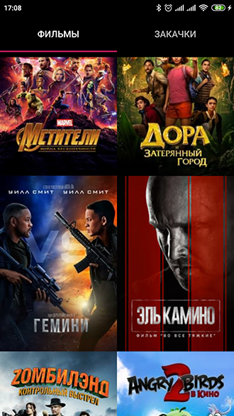
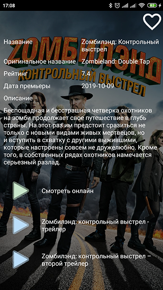
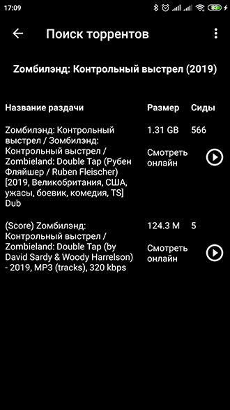
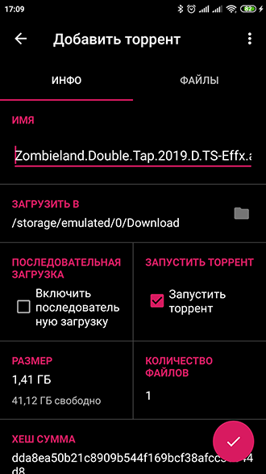
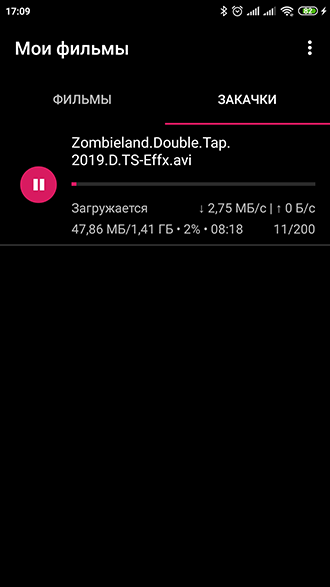
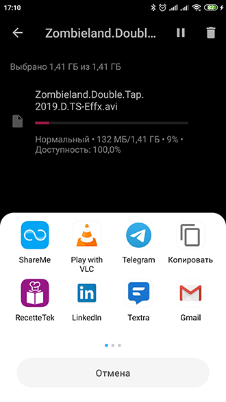

MyMovies
=====================

MyMovies is a small app that can receive movies descriptions via [(TMDb) API - The Movie Database API](https://developers.themoviedb.org/3/getting-started/introduction),
search torrents on [RuTracker](https://rutracker.org/forum/index.php) and download from there.
The app is based on [LibreTorrent](https://github.com/proninyaroslav/libretorrent) torrent client.

**The REST API backend is required and can be found by [the link](https://github.com/MrBinWin/mymovies-backend)**.

Translations
---

Current languages:

 - Russian
 - English

Installation
---
After installation you need to setup the following settings:
 - [TMDb API key](https://developers.themoviedb.org/3/getting-started/introduction)
 - [Backend server address](https://github.com/MrBinWin/mymovies-backend)

Screenshots
---

  
  
 

License
---

    Copyright (C) 2019 Dmitry Kuznetsov <mrbinwin@gmail.com>
    This file is part of MyMovies.
    MyMovies is free software: you can redistribute it and/or modify
    it under the terms of the GNU General Public License as published by
    the Free Software Foundation, either version 3 of the License, or
    (at your option) any later version.
    This program is distributed in the hope that it will be useful,
    but WITHOUT ANY WARRANTY; without even the implied warranty of
    MERCHANTABILITY or FITNESS FOR A PARTICULAR PURPOSE.  See the
    GNU General Public License for more details.
    You should have received a copy of the GNU General Public License
    along with this program.  If not, see <http://www.gnu.org/licenses/>.